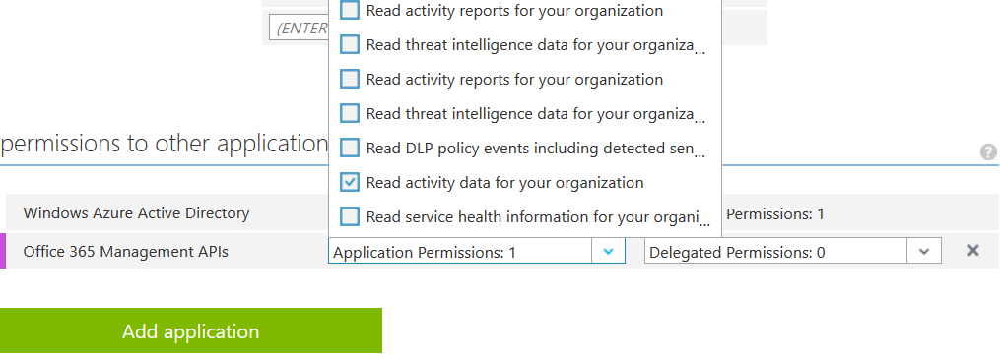

# Delegate Audit Log Exporter

## Installation

### Registration in Active Directory

1. Sign in to the Azure management portal. ([management.microsoftazure.com](https://management.microsoftazure.com))
2. Click on Active Directory in the left hand nav.
3. Click the directory tenant whose audit data you want to export.
4. Click the Applications tab.
5. In the bottom drawer, click Add.
6. Click "Add an application my organization is developing".
7. Enter a friendly name for the application, "Audit Log Exporter", for example, then select "Web Application and/or Web API", and click next.
8. For the sign-on URL, enter the URL to where the DALE instance will be hosted. You can change the value at a later time.
9. For the App ID URI, enter https://<your_tenant_name>/dale, replacing <your_tenant_name> with the name of your Azure AD tenant.

Your application is now registered. However, before moving on to the next step, you need to grant DALE access to the Management API on your tenant.

a. While still in the Azure portal, click the Configure tab of your application.
b. Find the Client ID value and copy it to the clipboard. You will need it later.
c. Scroll to the bottom of the Configure tab, and click add application
d. Select the Office 365 Management APIs.
e. Under Application Permissions, grant the `Read activity data for your organization` permisison.

f. Scroll up to the heading "Keys", and add a new key with a duration of your choosing.
g. Hit the `Save` button in the bottom drawer.
h. You will now see the key value displayed. Copy the text somewhere safe -- you will need it at a later stage and it cannot be retrieved once you've left this screen.
i. Finally, before leaving the Portal, you will need to take note of your Tenant ID:

The tenant ID can be obtained from the URL when you are browsing the Active Directory blades in the Classic Portal. The URL will appear as below:

    https://manage.windowsazure.com/tenantname#Workspaces/ActiveDirectoryExtension/Directory/00000000-0000-0000-0000-000000000000/directoryQuickStart
    
That GUID is the Id for the Tenant.

### Setup DALE

After deploying DALE however you see fit, it is necessary to declare some environment variables. If you're hosting as an Azure Web App, you can easily set these environment variables in the Portal, under Application Settings.

    Tenant=yourdomain.onmicrosoft.com
    ClientId=yourclientId
    ClientSecret=yourclientSecret
    AzureConnectionString=yourStorageConnectionString
    
### Subscribe to WebHook

The last step is to configure your tenant's management API to send Audit events to DALE. You can do this via an HTTP POST to the management API.

A script is provided to automate this task. Begin by opening `subscribe.fsx` script and replacing the variables at the top of the file with the values you collected in the previous steps.

Then, you can execute the script via the `subscribe.cmd` or `subscribe.sh` wrappers.